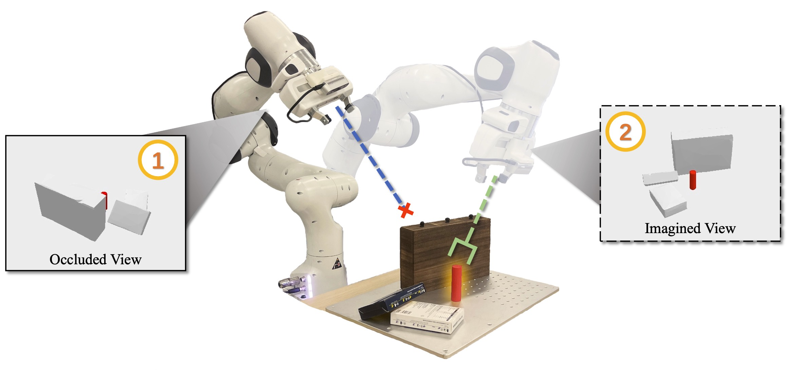

# ACE-NBV

# Task



# Installation

1. Restore the conda environment.

    ```
    conda env create -f environment.yaml
    ```

1. Go to the root directory and install the vgn project locally using `pip install -e .`.

1. Build ConvONets dependents by running `python scripts/convonet_setup.py build_ext --inplace`.

1. Download .urdf and .obj file of objects from https://drive.google.com/file/d/1LFxgZ544ZnDxKd8U38-iSGK2Lwzw_k8W/view?usp=sharing.
    Extract the files to `data/`.

1. Build dataset.

    ```
    python -m data.data_generator ./data/set/data_facing_grasp_1M --observation-type facing --num-grasps 1000000
    python -m data.data_generator ./data/set/data_side_grasp_1M --observation-type side --num-grasps 1000000
    python -m data.data_generator ./data/set/data_multiview_grasp_2M --observation-type multiview --num-grasps 2000000
    ```

1. Train the model.

    ```
    python train.py
    ```

    Optional parameters (supported by Hydra, config file at `configs/ACE.yaml`)：
    hydra=debug, epochs=xxx, batch_size=xxx, geometry_decoder=none, geometry_decoder.loss_eik_weight=0.0, etc.

    Training process monitoring：
    tensorboard --bind_all --port=10091 --logdir=experiments/

1. Test the grasp.

    ```
    python grasp.py [experiment_name]
    ```
    Note: The real-world experiments based on the Franka robotic arm rely on [deoxys_control](https://github.com/UT-Austin-RPL/deoxys_control).


## File Structure
```
.
├── configs: Configuration files (e.g., data paths, hyperparameters)
├── data: Dataset generation and retrieval
├── docs: Documentation
├── experiments: Training logs and checkpoints
├── franka
├── models: Network definitions
│   ├── decoder_module
│   ├── encoder_module
│   └── networks.py: Entry point
├── scripts: Scripts
├── src: Dependencies
├── utils: Miscellaneous tools
├── environment.yaml
├── grasp.py
├── setup.py
├── train.py
└── README.md

```
